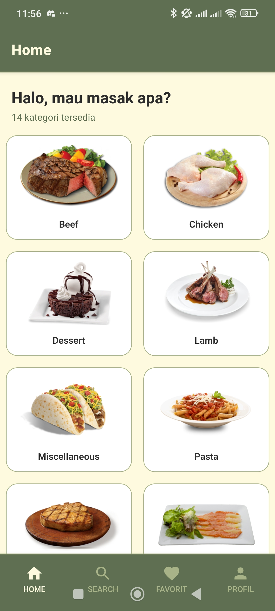
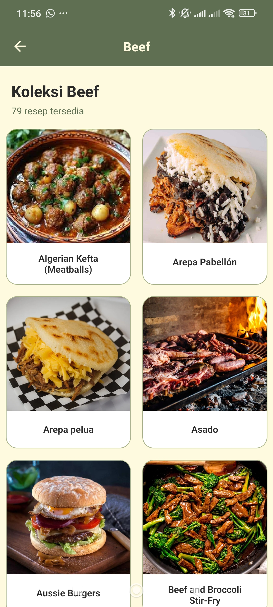
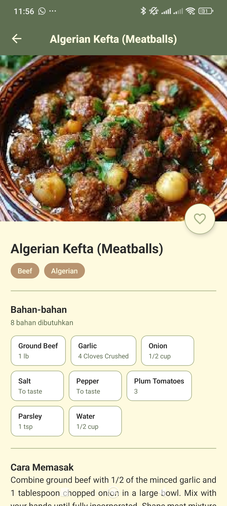
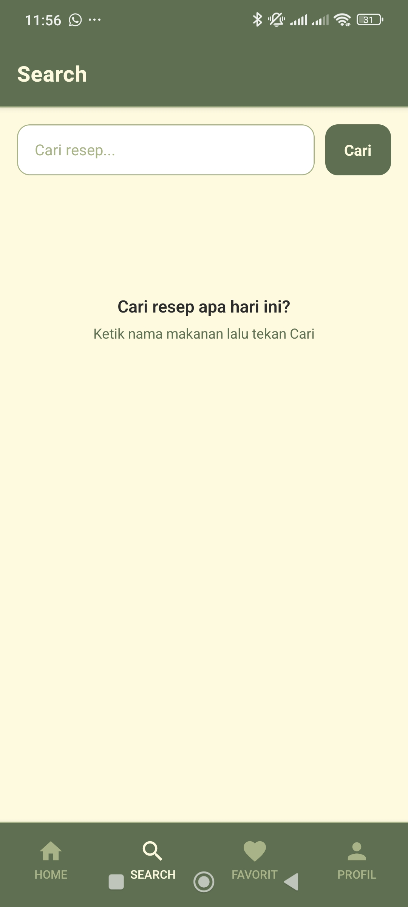
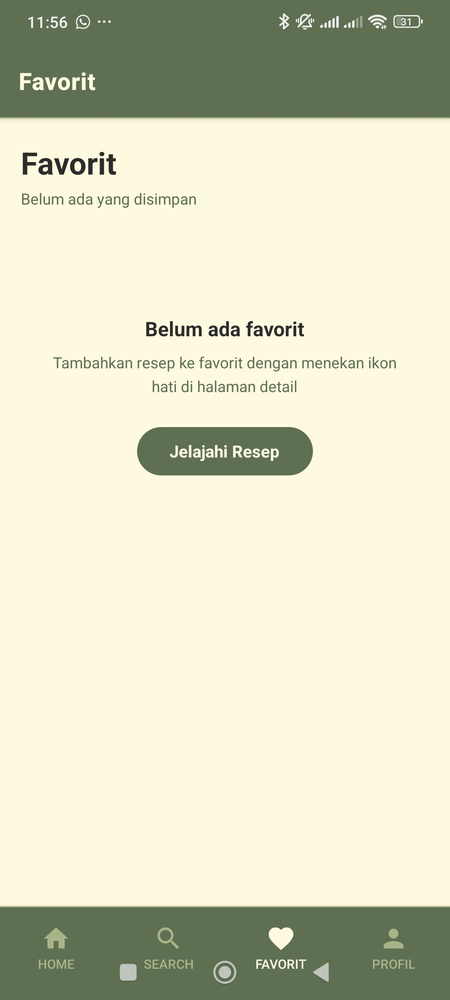
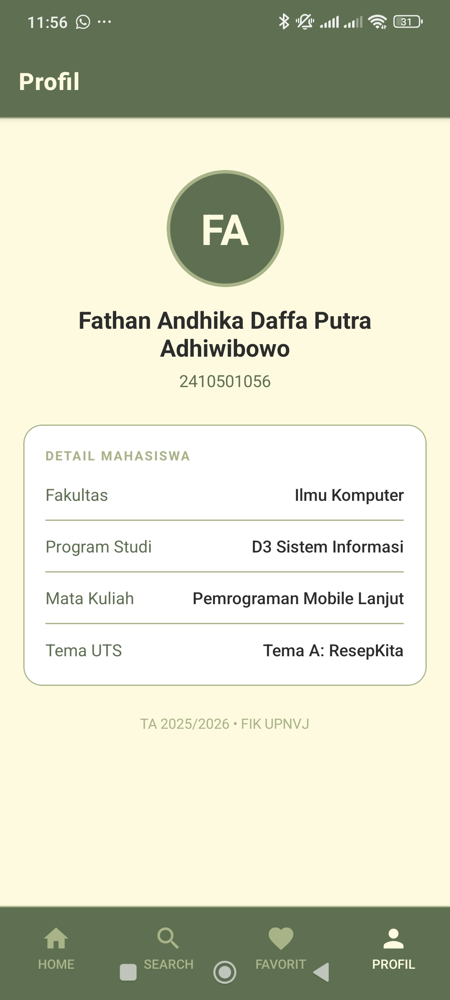

# UTSMobLanjut

## Judul Project

**OurRecipe: Katalog Resep Kuliner untuk keseharian kalian.**

Nama  : Fathan Andhika Daffa Putra Adhiwibowo  
NIM   : 2410501056  
Kelas : A

## Tema yang dipilih

**Tema A: ResepKita - Katalog Resep Kuliner**

## Tech Stack
Framework : React Native + Expo SDK  
Bahasa : JavaScript  
Navigation : @react-navigation/native + stack + bottom-tabs  
HTTP Client : axios  
State Mgmt : Zustand  
Package Mgr : npm  
Testing : Expo Go (Android/iOS)

## Cara install & run
Clone Repositori: git clone https://github.com/Fathan-Andhika-Daffa/uts-mobile-lanjut-2410501056-FathanAndhikaDaffaPutraAdhiwibowo/  
Masuk kedalam folder: cd OurRecipe  
Install Dependencies: npm install  
Jalankan Project: npx expo start

## Screenshots
Tampilan HomeScreen  
  

Tampilan BrowseScreen  
  

Tampilan DetailScreen  
  

Tampilan SearchScreen  
  

Tampilan FavoritesScreen  
  

Tampilan AboutScreen  
  

## Link video demo
https://youtu.be/ux-EcI9MIrQ

## State Management: Zustand + useState
Zustand digunakan untuk menyimpan state global (daftar favorit) yang diakses dari DetailScreen dan FavoritesScreen. Sementara itu, useState digunakan untuk mengelola state lokal di setiap layar, seperti loading, error, dan hasil dari fetch.  

Dipilih karena tidak membutuhkan wrapper provider, sintaksnya lebih mudah dibanding Redux, dan komponen hanya mengalami re-render saat state yang diperlukan berubah.

## Daftar referensi
[Tutorial Membuat Aplikasi Pertama dengan Expo] https://docs.expo.dev/tutorial/create-your-first-app/  
[Tutorial Navigasi Aplikasi di Expo] https://docs.expo.dev/develop/app-navigation/  
[Tutorial React Native untuk Pemula] https://www.youtube.com/watch?v=m1-bc53EGh8  
[Tutorial React Navigation Bottom Tabs] https://www.youtube.com/watch?v=7Au4fG0sWZY  
[Tutorial Fetch API di React Native] https://www.youtube.com/watch?v=U2Hg-MAAz_M  
[Dokumentasi Zustand State Management] https://docs.pmnd.rs/zustand/getting-started/introduction  
[Dokumentasi React Navigation] https://reactnavigation.org/docs/getting-started  
[Dokumentasi Axios HTTP Client] https://axios-http.com/docs/intro  
[Dokumentasi TheMealDB API] https://www.themealdb.com/api.php  
[Referensi React State Management] https://medium.com/globant/react-state-management-b0c81e0cbbf3  
[Referensi FlatList numColumns React Native] https://stackoverflow.com/questions/65475648/react-native-flatlist-numcolumns-is-not-making-multiple-columns  
[Referensi Dark Theme di React Native] https://stackoverflow.com/questions/67905490/react-native-dark-theme-in-class-based-project  
[Referensi useContext di React Native] https://stackoverflow.com/questions/77746064/react-native-function-does-not-fire-thru-usecontext  
[Referensi Axios Interceptor di React Native] https://stackoverflow.com/questions/59487843/facing-some-issues-while-creating-axios-interceptor-in-react-native  
[Referensi Pass Params di React Navigation] https://stackoverflow.com/questions/53483599/react-navigation-pass-params-to-nested-stacknavigator  
[Referensi Hide Keyboard di React Native] https://stackoverflow.com/questions/29685421/hide-keyboard-in-react-native  

## Refleksi pengerjaan
Pengerjaan project berjalan cukup lancar. Tantangan terbesarnya adalah pengaturan navigasi bertingkat antara Stack dan Tab Navigator, serta memastikan parameter dari satu layar ke layar lainnya dikirimkan dengan tepat. Selain itu, pindah dari Context API ke Zustand pernah butuh penyesuaian, tapi akhirnya jadi lebih mudah dan lebih cepat.  
Bug yang dialami hanya pada saat penambahan favorite di DetailScreen, saat ditekan tombolnya tidak langsung berubah iconnya.  
Dari project ini, banyak hal yang dipelajari, seperti React Navigation dan axios interceptor.